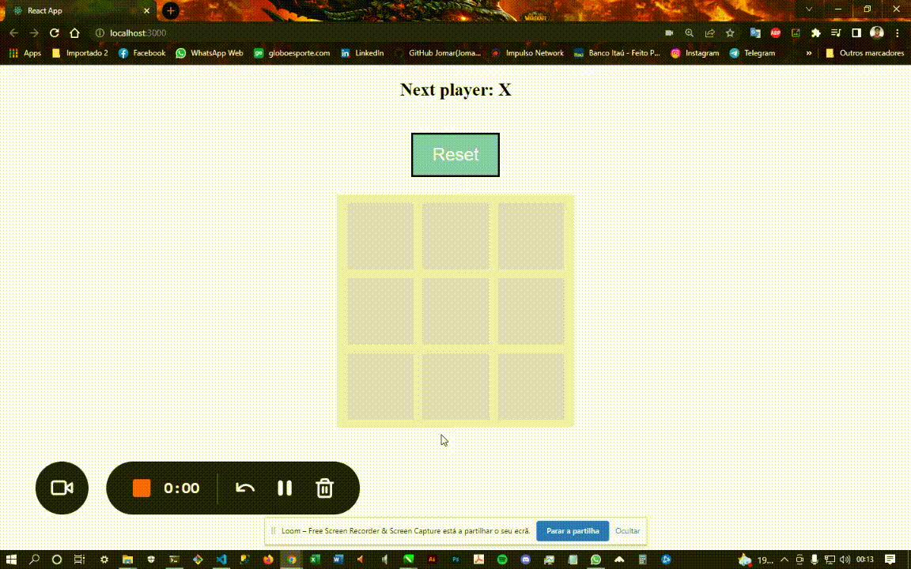

# ❌🔘 Jogo da Velha ✖️⭕
<br />

<p align="center">
    
</p>

<br/><hr/><br/>

<p align="center">Conteúdo do projeto</p>

<p align="center">
    <a href = "#sobre">Sobre</a> •
    <a href = "#pré-requisitos">Pré-requisitos</a> •
    <a href = "#rodando-o-arquivo">Rodando o arquivo</a> •
    <a href = "#tecnologias">Tecnologias</a> •
    <a href = "#contato">Contato</a>
    </p>

<br/><hr/><br/>

### Sobre
<br/>

<p> A criação de um jogo da velha simples feito com aplicação em ReactJs. Até o momento está utilizável. Tem mais coisas pra aplicar nele, fazendo uma versão 2.0 dele em breve...</p>
<br/>
<h3 align="center">
    🚧 Projeto do Jogo da Velho em construção... 🚧
</h3>
<br/><hr/><br/>

### Pré-requisitos
<br/>

Antes de começar, você vai precisar ter instalado em sua máquina as seguintes ferramentas: [Git](https://github.com/) e o [Node.js](https://nodejs.org). Além de um editor de para trabalhar com o código como o: [VSCode](https://code.visualstudio.com/).

<br/><hr/><br/>

### Rodando o arquivo
<br/>

```bash
# Clone esse repositório
$ git clone https://github.com/JomarFranca/JogoDaVelha_Game.git

# Acesse a pasta do projeto no terminal
$ cd [nome da pasta]

# Instale as dependências
$ npm install aplicação

# Execute a aplicação em modo desenvolvimento
$ npm start

# por padrão o servidor irá iniciar na porta:3000
```

<br/><hr/><br/>

### Tecnologias
<br/>

<p>As seguintes ferramentas foram usadas na construção do projetos</p>

- [JavaScript](https://www.javascript.com/)
- [ReactJs](https://reactjs.org/)

<br/><hr/><br/>

### Contato
<br/>

Feito por JOMAR FRANÇA - [Acesse meu Likedin](https://www.linkedin.com/in/jomar-almeida-franca/)

Obs. Contribuição de Carlos Júnior

